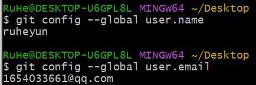
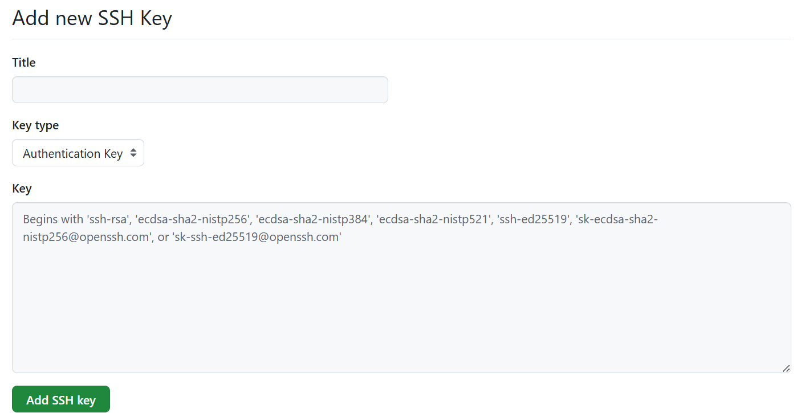

(1) 注册 GitHub，下载安装 Git

(2) 右键桌面，使用 git bash，设置用户名和邮箱
```
# 配置用户名 
git config --global user.name "github上注册的用户名"  

# 配置用户邮箱
git config --global user.email "github上注册的邮箱" 

# 查看配置的用户名  
git config --global user.name   

# 查看配置的用户邮箱
git config --global user.email 

# 这里的用户名和邮箱可以任意填写，但是建议和注册时的 Github 用户名和邮箱相同
```


(3) 获取 ssh 密钥，一直回车即可
```
ssh-keygen -t rsa -C "GitHub上注册时的邮箱"
```

(4) 登录 Github ，然后在设置里找到 ssh keys ，将获取的`公钥`粘贴进去。


(5) 检查远程 Github 是否添加了本地了公钥
```
ssh -T git@github.com
```

(6) 先在本地创建一个文件夹初始化为一个仓库
 ```
git init
 ```

(7) 将这个文件夹里更改的文件添加到仓库暂存区（在文件夹里的文件称为工作区）
```
# 添加某一个修改文件  
git add updata.txt  
 ​  
# 或者添加所有修改的文件  
git add .  
 ​  
# 查看哪些文件在暂存区（不是必须操作）  
git status
```

(8) 将暂存区的文件提交到本地仓库
```
# 提交文件到本地仓库
git commit -m "提示信息"  
 ​  
# 查看提交历史  
git log

# 这里的提示信息可以重复使用一句话，但是为了分辨每次提交，建议使用不同信息
```

(9) 上面步骤完成本地操作后，在 Github 里创建一个仓库，将用于保存本地上传的文件，Github 仓库名和本地仓库名不用一样（但是建议一样）

(10) 连接 Github 远程仓库
```
# 假设仓库名为：git@github.com:ruheyun/python_leetcode.git  
git remote add origin git@github.com:ruheyun/python_leetcode.git 
 
# 查看当前仓库的远程仓库配置  
git remote -v
``` 
 ​  
(11) 连接了远程仓库后，将远程仓库 main 分支下所有文件拉取到本地和本地文件合并，防止本地文件上传远端后覆盖了远端已经存在的文件
```
git pull origin main --rebase
```

(12) 上传本地仓库
 ```
 git push -u origin main
 ```

(13) 当你第一次上传时需要经过上面步骤，以后只要本地仓库和远程仓库不变，使用下面命令即可
```
git add .  
git commit -m "xxx"  
git push
```

(14) 两台电脑协作时

本地有文件的电脑，按照上面步骤执行，将本地文件上传 Github
 ​  
另一台电脑，没有文件需要从远程仓库下载的，按照下面执行  
 1. 下载 Git  
 2. 设置相同的用户名和邮箱  
 3. 获取 ssh 密钥，添加到 Github  
 4. 使用 git clone https...  (https 通常下载速度快，但是通过这种方式下载的代码，在本地修改后不能直接推送，需要将 https 改为 ssh)
 5. 改成 ssh 推拉代码 git remote set-url origin git@github.com:...  
 6. 查看远程连接使用的方式 git remote -v

(15) 注意使用两台电脑协作时

两台电脑都要养成先 pull 再 push 的习惯  
```
git pull origin main  
 ​  
git add .  
git commit -m ""  

git push origin main
```

> Q：本地电脑有两个仓库，连接到同一个 Github 账号中的两个远程仓库，每次都需要输入git remote add origin吗，还是只需要输入一次，以后直接git push就行?
> 
> A：**各自只需配置一次远程地址**，之后就可以直接 `git push` 了。因为配置远程地址后，会自动将配置信息保存在项目文件夹下的 .git 里。

