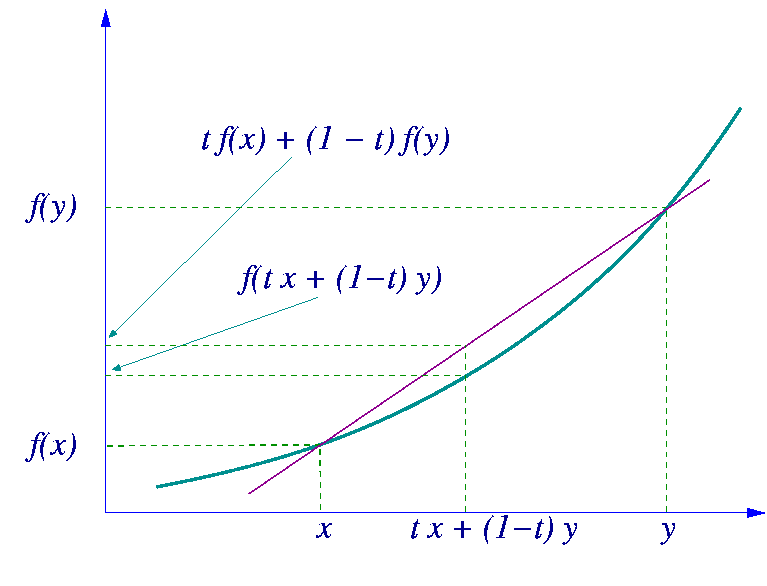

# 数学公式

## 泰勒展开式
定理：
设 $n$ 是一个正整数。如果定义在一个包含 $a$ 的区间上的函数 $f$ 在 $a$ 点处 $n+1$ 次可导，那么对于这个区间上的任意 $x$ ，都有：
$$
f(x) = f(a) + \frac{f'(a)}{1!}(x-a) + \frac{f^{(2)}(a)}{2!}(x-a)^2 + \dots + \frac{f^{(n)}(a)}{n!}(x-a)^n + R_n(x)
$$
其中的多项式称为函数在 $a$ 处的泰勒展开式，剩余的 $R_n(x)$ 是泰勒公式的余项，是 $(x-a)^n$ 的高阶无穷小。

常用展开式：
$$
e^{x}=\sum_{n=0}^{\infty} \frac{1}{n !} x^{n}=1+x+\frac{1}{2 !} x^{2}+\cdots ,x\in(-\infty,+\infty)
$$

$$
\sin x=\sum_{n=0}^{\infty} \frac{(-1)^{n}}{(2n+1)!} x^{2n+1}=x-\frac{1}{3!}x^{3}+\frac{1}{5!} x^{5}+\cdots, x \in(-\infty,+\infty)
$$

$$
\cos x=\sum_{n=0}^{\infty} \frac{(-1)^{n}}{(2 n) !} x^{2 n}=1-\frac{1}{2 !} x^{2}+\frac{1}{4 !} x^{4}+\cdots, x \in(-\infty,+\infty)
$$

$$
 \ln (1+x)=\sum_{n=0}^{\infty} \frac{(-1)^{n}}{n+1} x^{n+1}=x-\frac{1}{2} x^{2}+\frac{1}{3} x^{3}+\cdots, x \in(-1,1]
$$

$$
 \frac{1}{1-x}=\sum_{n=0}^{\infty} x^{n}=1+x+x^{2}+x^{3}+\cdots, x \in(-1,1)
$$

$$
\frac{1}{1+x}=\sum_{n=0}^{\infty}(-1)^{n} x^{n}=1-x+x^{2}-x^{3}+\cdots, x \in(-1,1)
$$

$$
 (1+x)^{\alpha}=1+\sum_{n=1}^{\infty} \frac{\alpha(\alpha-1) \cdots(\alpha-n+1)}{n !} x^{n}=1+\alpha x+\frac{\alpha(\alpha-1)}{2 !} x^{2}+\cdots, x \in(-1,1) 
$$

## Laplace 原理
定理：
一系列指数项求和的对数，在渐近极限下等于其中最大的指数值：
$$
\log \left( \sum_i e^{a_i} \right) \approx \max_i a_i
$$
更精确地，对于包含温度参数 $\epsilon$（当 $\epsilon \to 0$ 时）的连续形式，它渐近等价于：
$$
\epsilon \log \left( \int e^{\frac{f(x)}{\epsilon}} \, dx \right) \approx \max_x f(x)
$$
注：在物理学、统计学和机器学习中，==温度参数==（通常记为 $\epsilon$ 或 $T$ ）是一个调节系统“确定性”与“随机性”的控制变量。它借用了热力学中“温度”的概念：温度越高，系统越混乱（随机）；温度越低，系统越冷凝（倾向于最大值）。

## 赫尔德不等式
Holder’s inequality

本质理解：
两个函数乘积的积分，不会超过它们各自"大小"的乘积
定义：
对于实值函数 $f$ 和 $g$ ，以及满足 $\frac{1}{p} + \frac{1}{q} = 1$ 的 $p,q>1$ ：
$$
\|fg\|_1 \leq \|f\|_p \|g\|_q
$$
即：
$$
\int |f(x)g(x)|dx \leq \left(\int |f(x)|^p dx\right)^{\frac{1}{p}} \left(\int |g(x)|^q dx\right)^{\frac{1}{q}}
$$
当 $p = q = 2$ 时，赫尔德不等式变为`柯西-施瓦茨不等式`。

## 琴生不等式
Jensen's inequality

简单理解：
对一平均做凸函数变换，会小于等于先做凸函数变换再平均。
基本性质：
过一个凸函数上任意两点所作割线一定在这两点间的函数图象的上方，即：
$$
t f(x_1) + (1 - t) f(x_2) \geq f(tx_1 + (1 - t)x_2), \quad 0 \leq t \leq 1.
$$

## 蒙特卡洛
Monte Carlo

例子：$x$ 是一维随机变量，$p(x)$ 是 $x$ 的概率密度，$f(x)$ 是 $x$ 的标量函数，求 $f(x)$ 的期望：
$$
\mathbb{E}_p[f(x)] = \int p(x)f(x)dx
$$
事实上，当 $x$ 的维度很高时，上述期望计算是高维积分，难以直接计算。
蒙特卡洛方法：用平均值来近似期望值。当N很大时，由大数定律，平均值近似期望：

$$
\mathbb{E}_p[f(x)] \approx \frac{1}{N} \sum_{i=1}^N f(x_i) \quad x_i \sim p(x)
$$
无偏推导：令 $\mu$ 为真实期望，$\hat{\mu}$ 为平均值
$$
E[\hat{\mu}]=E[\frac{1}{N} \sum_{i=1}^{N} f(x_i)]=\frac{1}{N} \sum_{i=1}^{N} E[f(x_i)]=\frac{1}{N} \sum_{i=1}^{N} \mu=\mu
$$

## Jacobian 矩阵
向量对向量求导得到的矩阵通常就是雅可比矩阵（Jacobian matrix）。

## Hessian 矩阵
对多元函数求**一阶导数**得到的是**梯度**，而对函数求**二阶导数**（或者说对梯度再求一阶导数）得到的是**黑塞矩阵（Hessian Matrix）**。

常用的衡量两个概率分布 P，Q 的距离或差异方法。

## Total Variation Distance

总变差距离：两个分布曲线之间‘面积差’的一半。缺点：高维时难以估计。

连续：

$$D_{TV}(P, Q) = \frac{1}{2} \int \mid p(x) - q(x) \mid dx$$

离散：

$$D_{TV}(P, Q) = \frac{1}{2} \sum_i \mid p_i - q_i \mid$$

## KL Divergence

KL 散度：用Q去近似P，会额外损失多少编码长度。最大似然估计（MLE）本质就是最小KL散度。

连续：

$$D_{KL}(P \parallel Q) = \int p(x) log \frac{p(x)}{q(x)} dx$$

> KL散度是非对称的，将P和Q换个位置后不等。

## Jensen-Shannon Divergence

JS 散度：对称、有界、比KL稳定，常用于GAN的优化函数。

连续：

$$JS(P, Q) = \frac{1}{2} D_{KL} (P \parallel M) + \frac{1}{2} D_{KL} (Q \parallel M)$$

其中：

$$M = \frac{P + Q}{2}$$

## Fisher Divergence

几何意义：两个分布的分数场，即概率流形上的梯度方向。基于分数的扩散模型中核心思想。

连续：

$$D_F (P \parallel Q) = E_P [\parallel \nabla_x log p(x) - \nabla_x log q(x) \parallel^2]$$

## Wasserstein Distance
Earth Mover Distance

地球移动距离（推土机距离）：把P看作一堆土，Q看作目标土堆，将P搬运到Q的最小搬运成本。

$$W(P, Q) = inf_{\gamma \in \prod(P, Q)} E_{(x,y) \sim \gamma} [\parallel x - y \parallel]$$

## Mahalanobis Distance

马氏距离：考虑协方差后的‘真实欧式距离’。

$$d_M(x,y) = \sqrt{(x - y)^T \Sigma^{-1} (x - y)}$$

